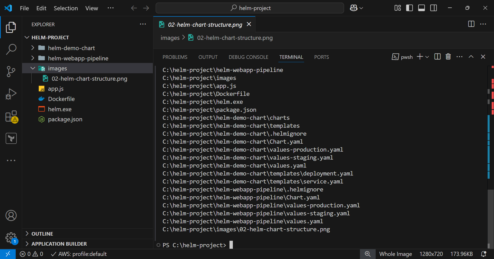
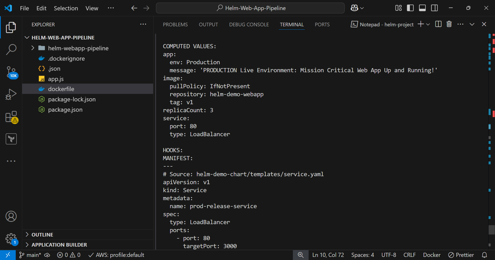

# Web-App--Deployment
# Enterprise Multi-Environment Web App Deployment Pipeline with Helm & Kubernetes

Here is my enterprise-grade implementation demonstrating Cloud-Native orchestration using **Helm** to package, configure, and dynamically deploy a highly available web application across isolated **Staging** and **Production** environments on **Kubernetes (AWS EKS)**.

## Key Engineering Capabilities Demonstrated
* **Infrastructure as Code (IaC):** Designed dynamic Helm templates to remove hardcoded application values.
* **Multi-Environment Orchestration:** Maintained strict configuration isolation using `values-staging.yaml` and `values-production.yaml`.
* **High Availability & Scaling:** Configured automated replication policies (horizontal pod scaling) for mission-critical reliability.
* **Cloud Network Routing:** Provisioned public-facing AWS Classic Load Balancers via Kubernetes service manifests.
* **Production Troubleshooting:** Diagnosed and resolved real-world container registry and port-mapping (`targetPort`) mismatches.

---
  
## System Architecture & Deployment Pipeline


### 1. Containerization & Base Layer Validation
The pipeline begins by containerizing the application context using an optimized Docker multi-stage configuration, ensuring absolute environment consistency from local testing to the public cloud.

* **Asset Verification:** Building and tagging the underlying container layer locally.
* 

### 2. Helm Chart Blueprinting
Instead of managing fragmented, static Kubernetes manifests, the architecture utilizes a single parameterized Helm chart. This packages standard resources (Deployments, Services) into dynamic components.

* **Asset Verification:** Standardized Helm package and templates directory structure.


### 3. Pre-Flight Emulation & Simulation (Dry-Runs)
To protect active cluster runtimes, strict schema validation and structural parsing are executed via Helm dry-runs before touching real infrastructure. This confirms that templates evaluate correctly with environment-specific overrides.

* **Asset Verification:** Dry-run evaluation generating a scaled-out (`replicaCount: 3`) Production manifest.


### 4. Live Cluster Deployment & Lifespan Monitoring
Once validated, Helm coordinates live creation instructions directly to the cluster control plane. Workloads are dynamically separated: Staging runs as a single instance behind a secure internal IP, while Production scales wide.

* **Asset Verification:** Monitoring healthy, actively running application pods across environments.


### 5. Cloud Routing & Public Validation (The Result)
The ultimate validation proves edge network routing. Kubernetes interfaces directly with the AWS cloud provider API to automatically provision and map external load balancing routing tables, opening the application to verified traffic.

* **Asset Verification:** Production environment running live on the public internet behind an active AWS Load Balancer.


---

## Technical Commands Reference Quick-Start

### Dry-Run Emulation:
```powershell
.\helm install prod-release .\helm-demo-chart --values .\helm-demo-chart\values-production.yaml --dry-run --debug
